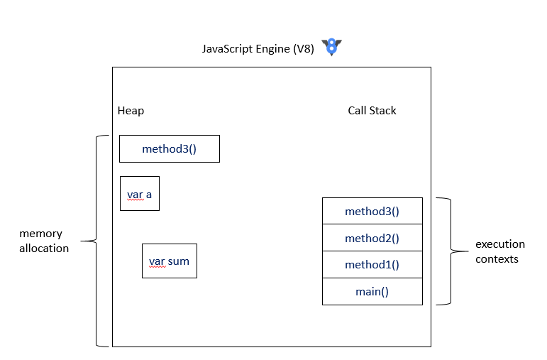
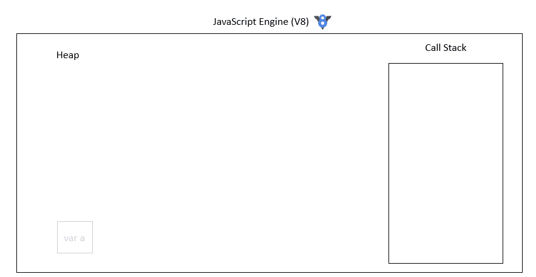
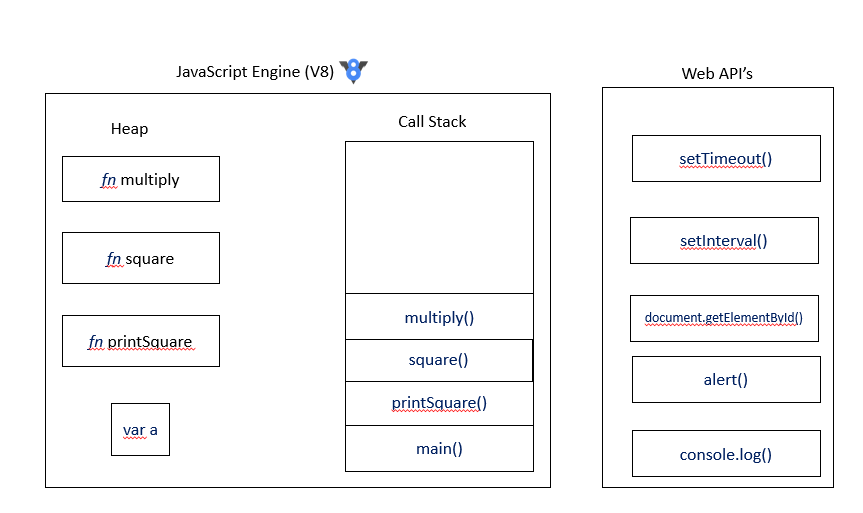

Event Loop
==========

##What is JS?:

Let's as JS what are you?:

JS replies |
`I am a single-threaded, non-blocking, asynchronous, concurrent language.`

We will try to understand what exactly each of these keywords mean in this document.

For a start lets ask JS what does it have?

JS replies |
`I have a heap, call stack, event loop, a callback queue and some other helper APIs`

What exactly are heap, call stack etc.?

Lets take a closure look at Java-script Engine.
The most popular JS engine is Chrome's V8 Engine.
It looks something like this.



Whenever a variable/function declaration is encountered, memory for the newly declared variable/function is allocated in the heap of the engine.
Whenever a function is called, it add an activation record on the call stack.
When a function finishes its execution it will pop out from the call stack.

Let's check what happens during run time.

For demo purposes consider following code:  

```js
    var a = 2;
    
    function multiply(fistNumber, secondNumber) {
        return fistNumber * secondNumber;
    }
    
    function square(number) {
        return multiply(number, number);
    }
    
    function printSquare(number) {
        var squareOfNumber = square(number);
        console.log(squareOfNumber);
    }
    
    printSquare(2);
```

The image below illustrates how JS engine executes the following script:



functions and variable when declared reserve memory on heap and a reference is returned back.
We can call or access these declared variables/functions using their references.
Now when we try to execute a function by calling it the engine will first create a new `execution context` or an `activation record` for the function that we are trying to call, This `execution contex/activation record` has information of things like scope.
Now the Engine pushes the function's `execution contex` on the Call Stack.
Once the execution of the function is done, it is popped out of the call-stack.  

### What about API's that are provided out of the box by browser?
If you download the source code of V8 engine and try to search things like `setTimeout`, `setInterval` or `document.getElementById` etc. you will not be able to find it there.
These OOB functions are not a part of JS Engine but are provided by the browser separately.

We can visualize it as follows:



### Blocking (What happens when things are slow?)

When something is being executed on the call-stack javascript engine cannot do any other thing as we know JS is single-threaded. i.e it can perform only one operation at a given time.
Consider, that you have a function which has a loop which runs a billion times each time performing a heavy operation. As per the  

  

 

Javascript Architecture:

 1. Engine: The most popular JS engine is Chrome's V8 Engine.    

